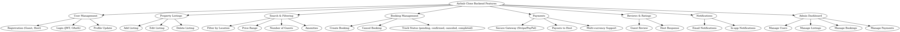

# Airbnb Clone Backend – Features & Functionalities

---

## 1. User Authentication
- User registration (sign up with email & password)
- Login (JWT/session-based authentication)
- Password hashing and security
- Profile management (update name, email, password)
- Account deletion

---

## 2. Property Management
- Create a property listing (title, description, price, location, availability)
- Upload photos
- Update property details
- Delete property
- View all properties
- Search and filter properties by price, location, availability, etc.

---

## 3. Booking System
- Book a property (check-in, check-out dates)
- Prevent double bookings
- View user bookings
- Cancel bookings
- Host can manage bookings (accept/reject requests)

---

## 4. Payments
- Initiate payment for a booking
- Store payment status (pending, completed, failed)
- View payment history
- Refund and cancellation handling

---

## 5. Reviews
- Users can leave reviews for properties
- Ratings (1–5 stars)
- Comments with timestamps
- View all reviews for a property

---

## 6. Admin Features (Optional Advanced)
- Manage all users
- Manage all properties
- View booking and payment reports

---

## 📌 Diagram
Below is the system diagram illustrating these features:

