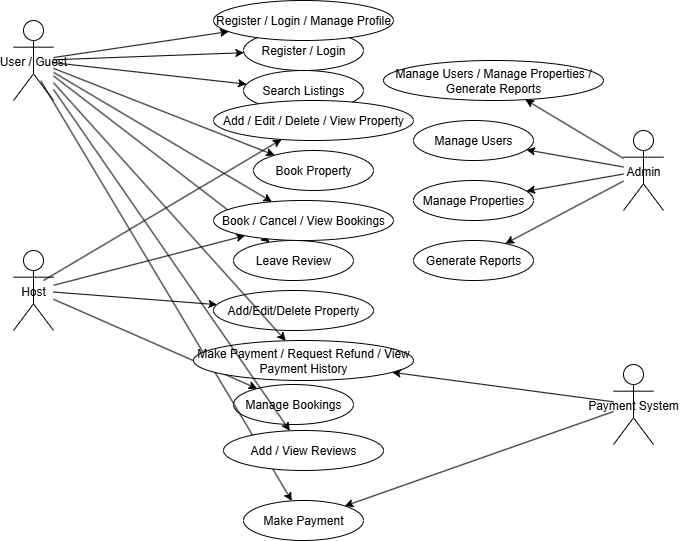

# Airbnb Clone – Use Case Diagram

This diagram illustrates the key interactions between actors (users, hosts, admins, and external systems) and the Airbnb Clone backend system.

---

## Actors
- **User/Guest**: Registers, logs in, books properties, makes payments, leaves reviews.
- **Host**: Manages property listings and bookings.
- **Admin**: Oversees users, properties, bookings, and payments.
- **Payment System**: Processes financial transactions.

---

## Key Use Cases
- **Authentication**: User Registration, Login, Profile Management.
- **Property Management**: Add/Edit/Delete Listings, View Listings.
- **Booking System**: Book Property, Cancel Booking, View Bookings.
- **Payments**: Make Payments, Handle Refunds, Track Payment Status.
- **Reviews**: Add Reviews, View Reviews.
- **Admin Management**: Manage Users, Properties, Reports.

---

## 📌 Diagram

